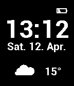

pebble-fancywatch
===================

## Pebble SDK 2.0 required

## How to build and install "Fancy Watch"

I assume that you've already set up your Pebble SDK.

**If you want to use make, you need to change the IP address in "Makefile"**

	make

If you don't like that approach you could also use the Pebble SDKs "pebble" command:

	pebble build
	pebble install --phone **YOUR_PHONE_IP**

## Licence

pebble-fancywatch is licenced under the terms of the MIT licence. (For more informations read the [LICENCE file](LICENCE)

## Graphics

The weather icons are made by the guys at [ModernUIIcons.com](http://modernuiicons.com). There is a licence file in **"resources/images"**.
